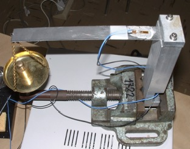

---
title:
  Statistica per la Misura
  
  Parte 6. --- Misura, incertezza e taratura
runningheader: "Misura, incertezza e taratura" # only for pdf output
subtitle: "Misura, incertezza e taratura" # only for html output
author:
  Paolo Bosetti,
  Dipartimento di Ingegneria Industriale, Università di Trento 
date: "Ultimo aggiornamento: `r Sys.Date()` - `r system('git describe --dirty=X', intern=T)`"
output:
  tufte::tufte_handout:
    number_sections: yes
    toc: yes
    citation_package: natbib
    latex_engine: xelatex
    keep_tex: false
    pandoc_args: [
      "-V", "papersize=a4paper"
    ]
  tufte::tufte_html:
bibliography: skeleton.bib
link-citations: yes
header-includes:
  - \usepackage[italian]{babel}
  - \usepackage{wasysym}
  - \usepackage{units}
  - \usepackage{fancyhdr}
  - \pagestyle{fancy}
  - \fancyhead[LO,LE]{\rightmark}
  - \fancyfoot[LO,LE]{\footnotesize \emph{Statistica per la Misura}}
  - \fancyfoot[CO,CE]{\includegraphics[height=0.5cm]{by-nc-sa.png}}
  - \fancyfoot[RO,RE]{\footnotesize \url{paolo.bosetti@unitn.it}}
---

```{r setup, include=FALSE}
library(tufte)
library(latex2exp)
library(tidyverse)
library(glue)
source("myfunctions.R")
theme_set(theme_gray()+theme(legend.position = "bottom"))
```
```{=tex}
\newcommand{\boxedpar}[1]{\bigskip\noindent\fbox{\parbox{\textwidth}{{#1}}}\bigskip}
```

# Misura e incertezza
`r newthought("L'operazione di misurare una grandezza è implicita")` in numerosissime attività umane, nonché alla base di qualsiasi **creazione di valore**, nel senso che non è possibile associare un valore ad un bene senza effettuare una misurazione. Ciò è maggiormente rilevante nell'ingegneria e in ambito scientifico.

È esperienza comune, inoltre, che le stesse operazioni di misura, inoltre, possono essere effettuate più o meno bene e con strumenti più o meno buoni, contribuendo quindi in diverso modo al valore complessivo del bene a cui si riferiscono.

Propriamente, la "bontà" di una misurazione è collegata alla sua **incertezza**, che è un termine intrinsecamente statistico: uno strumento di misura con incertezza limitata è in grado di fornire misure con una ridotta variabilità, e viceversa.

In questa Parte approfondiremo il concetto di incertezza e i suoi collegamenti con i metodi statistici visti fin ora.

## Incertezza
Secondo la **norma UNI4546**, una misura, che è il risultato di una misurazione, è una triade costituita da:

1. un **valore**
2. un'**incertezza**
3. un'**unità di misura**

Essa rappresenta il parametro di un sistema considerato in un suo determinato stato. Ad esempio: la mia statura è $183\pm 1$ mm. Ne consegue che in mancanza di uno qualsiasi di questi elementi non si può parlare di misura. Tuttavia, se il primo e il terzo elemento sono scontati nell'uso comune, è opportuno sottolineare che **anche l'incertezza è parte integrante di una misura**.

Il concetto di incertezza, storicamente, è stato diversamente interpretato fino alla redazione della normativa del *Joint Committee for Guides in Metrology* (JCGM) nota come *Guide to the expression of Uncertainty in Measurement*, o **GUM**, con la prima versione nel 1995 e una successiva revisione nel 2008 (@GUM2008).

La GUM definisce le procedure che guidano un operatore a definire l'incertezza di misura, in particolare sostituendo i termini, precedentemente utilizzati, di *errore** con **incertezza** e di **valore vero** con **stima**. Questo importante passaggio è dovuto all'osservazione che il valore vero non è conoscibile, in quanto ogni osservazione richiede necessariamente una misura e, anche supponendo di poter aumentare indefinitamente la risoluzione dello strumento di misura, prima o poi si arriverebbe a livello atomico in cui vale il principio di indeterminazione di Pauli. Di conseguenza, se non è definibile un valore vero non è nemmeno definibile un concetto di errore di misura.

Secondo la GUM, quindi, il risultato di una misurazione, che è una **variabile stocastica o aleatoria**, va trattato in quanto tale: la misurazione sarà tanto più buona quanto minore sarà la sua varianza, o incertezza, e l'osservazione di un campione statistico di misurazioni può consentire di *stimare* il valore atteso della grandezza in studio.

È evidente che l'incertezza di uno strumento o di un sistema di misura dipende dalle caratteristiche dello stesso e va quindi valutata caso per caso.

# Modello statico di uno strumento di misura
`r newthought("Uno strumento di misura è un dispositivo")` che consente di effettuare una operazione di **misurazione**, cioè di confronto di una determinata grandezza con un valore di riferimento, esprimendo il risultato, cioè la **misura** come rapporto tra il valore del misurando e il valore del campione di riferimento. In altre parole, una lunghezza di 10.5 m significa 10.5 volte la lunghezza del metro campione di riferimento, individuato coma tale per accordo comune.

Tipicamente un dispositivo effettua una misurazione **direttamente**, cioè per confronto diretto con un campione, oppure **indirettamente**, cioè trasformando un segnale di qualche tipo, proporzionale al misurando in un valore numerico che costituisce la misura. 
```{marginfigure}
Un esempio di misura diretta è il metro a nastro; un esempio di misura indiretta è una bilancia digitale.
```
Il dispositivo che opera questa trasformazione tra la grandezza in ingresso e quella in uscita utilizzata per fornire la misura si chiama **trasduttore**. Nella maggior parte dei casi, soprattutto nell'era digitale, i trasduttori convertono grandezze fisiche (lunghezze, masse, velocità, accelerazioni, ecc.) in segnali elettrici, che possono essere a loro volta **misurati** e convertiti direttamente in un valore numerico grazie ai **convertitori analogico-digitali** (ADC).
```{marginfigure}
Non tutti i trasduttori hanno un segnale elettrico in uscita: ad esempio una bilancia meccanica da cucina ha un trasduttore che trasforma una forza nella rorazione di un ago, basato su una molla e su una coppia cremagliera/ruota dentata.
```
Nel caso di sensori che dispongono di un trasduttore, è evidente la necessità di identificare una relazione di proporzionalità tra la grandezza in ingresso e la misura in uscita. Se i trasduttori infatti sono progettati in modo da fornire un'**uscita proporzionale all'ingresso**, il modello analitico/numerico che descrive questa relazione di proporzionalità deve essere identificato---in forma e coefficienti---caso per caso. Questa operazione si chiama **taratura**

## Taratura statica
Quando si trascurano gli effetti dinamici, cioè quando si assume che il sistema nel suo complesso (misurando più sistema di misura) siano in stato stazionario, si parla di taratura statica. In queste condizioni il tempo non è una variabile. Per contro, la taratura dinamica (che si vedrà nei prossimi corsi) tiene in considerazione anche gli effetti tempo-dipendenti.


```{r taratura1, echo=FALSE, fig.margin=T, fig.cap="Misurazione: inversione della caratteristica statica, nota l'uscita per determinare il misurando"}
df <- tibble(
  i=1:100,
  x=seq(0,10,length.out=length(i)),
  y=sqrt(x),
  s=F
)
df[df$i%%10==0,]$s <- T

p1 <- df %>% ggplot(aes(x=x, y=y)) + 
  geom_line() + 
  labs(x="misurando (ignoto)", y="uscita osservata")

point <- filter(df, i==30)
arw <- arrow(angle=20, type="closed", length=unit(0.2, "inches"))
p1 +
  geom_segment(xend=point$x, yend=0, x=point$x, y=point$y, arrow=arw, color=gray(0.5)) +
  geom_segment(xend=point$x, yend=point$y, x=0, y=point$y, arrow=arw, color=gray(0.5)) + 
  geom_point(data=point, size=3, color="black", fill="blue", shape=21)
```


```{r taratura2, echo=FALSE, fig.margin=T, fig.cap="Taratura: identificazione della caratteristica statica, nota l'uscita e il misurando"}
point <- filter(df, i==30)
p1 +
  geom_segment(x=point$x, y=0, xend=point$x, yend=point$y, arrow=arw, color=gray(0.5)) +
  geom_segment(xend=point$x, yend=point$y, x=0, y=point$y, arrow=arw, color=gray(0.5)) + 
  geom_point(data=filter(df, s), size=3, color="black", fill="blue", shape=21) +
  labs(x="misurando (noto)", y="uscita osservata")
```

La taratura statica mira a determinare la correlazione  $y=f(m)$ tra l'ingresso misurando $m$ e l'uscita del trasduttore $y$, chiamata **caratteristica statica dello strumento**, nonché l'**incertezza di misura** dello stesso.

In condizioni statiche, uno strumento di misura fornisce la misura mediante **inversione** della caratteristica statica: $m=f^{-1}(y)$ (vedi Fig. \ref{fig:taratura1}).

Affinché la caratteristica statica sia nota è necessario determinarla sia in forma (cioè l'espressione analitica) che nei coefficienti. Questa è evidentemente un'operazione di **regressione**, che porta all'identificazione della caratteristica statica a partire da una serie di coppie $(m_i,y_i)$. Operativamente, dopo aver selezionato una serie di misurandi noti $m_i$ e aver registrato la corrispondente uscita non corretta $y_i$ si effettua una regressione lineare con i metodi visti precedentemente. (vedi Fig. \ref{fig:taratura2}).

I valori $m_i$ utilizzati durante la taratura possono essere:

* campioni di riferimento fondamentali per la grandezza in esame (ad es. 10 mm, 20 mm, 30 mm ecc.)
* campioni o ingressi generici **misurati** con uno strumento di riferimento

In entrambi i casi, sia i campioni che lo strumento di riferimento devono essere stati tarati con un'accuratezza migliore di almeno un ordine di grandezza rispetto a quella desiderata.
```{marginfigure}
In questo modo si costruisce la **catena di tracciabilità** degli strumenti di misura: ogni strumento è dotato di un certificato di taratura che include, tra l'altro, il riferimento allo strumento a sua volta utilizzato per la taratura, e così via fino ad arrivare allo strumento campione.
```

Per determinare la caratteristica statica dello strumento è generalmente individuata mediante quattro passaggi:

1. **Sviluppo del modello dello strumento**: mediante analisi dei principi fisici alla base del suo funzionamento si definisce un modello (che può essere analitico, numerico o misto) che serve a identificare quali sono i parametri di funzionamento e qual è la forma attesa per la caratteristica statica (lineare, quadratica, logaritmica, ecc.). Un modello completo include anche la relazione tra **ingressi di disturbo** e uscita (ad esempio temperatura, vibrazioni...)
2. **Raccolta dei dati di taratura**: si effettua una campagna sperimentale che raccoglie i valori in uscita per un determinato insieme di misurandi
3. **Regressione**: si effettua la regressione del modello sui dati raccolti, individuandone i parametri
4. **Validazione del modello**: si verifica l'adeguatezza del modello mediante analisi dei residui

Come sopra detto, tuttavia, l'operazione di taratura serve anche a definire l'**incertezza** dello strumento. Quest'ultima può essere dovuta essenzialmente a tre cause:

* incertezza sul modello (forma e numero di parametri della caratteristica statica)
* incertezza sulla curva di taratura (valore dei parametri)
* incertezza sulla stima del misurando, dovuta a **ingressi di disturbo**

A loro volta, gli **ingressi di disturbo** possono essere **modificanti** o **interferenti**.
```{r modello, fig.margin=T, fig.cap="Modello generale di uno strumento di misura", echo=F}
knitr::include_graphics("images/modellomisura.pdf")
```

Gli **ingressi modificanti** (vedi Fig.•\ref{fig:modello}) sono quelli che modificano la caratteristica statica, alterando cioè la forma della funzione $y=f(m)$, per cui ad uno stesso valore del misurando possono corrispondere diversi valori dell'uscita $y$ quando la $f()$ cambia in seguito all'azione del disturbo. Ovviamente, ciò significa che la $f()$ ha degli ingressi aggiuntivi che non sono stati presi in considerazione nel modello. 
```{marginfigure}
Se gli ingressi interferenti sono tipicamente aleatori, gli ingressi modificanti hanno un effetto che dipende dal fenomeno che li produce: se esso varia in maniera casuale, anche il suo effetto sarà casuale.
```

Gli **ingressi interferenti**, invece, si sommano all'uscita dello strumento, in modo che risulta $y=f(m)+y_d$, e hanno tipicamente un carattere stocastico.

Si noti che l'incertezza si riferisce **solo alla componente casuale** e non prevedibile della misura. Si assume che ogni componente di **deviazione sistematica** della misura (derivante da un **ingresso modificante**) sia già stato corretto.

## Esempio

Consideriamo la taratura di un **dinamometro a mensola** come quello illustrato in Fig. \ref{fig:cantilever}. Si tratta di una mensola snella orizzontale incastrata ad una estremità e con un carico verticale all'estremità opposta. La mensola è dotata di un **estensimetro** a resistenza variabile, un trasduttore in grado di convertire una **deformazione** in una variazione di resistenza elettrica.
Applicando un carico all'estremità libera della mensola essa si flette, mettendo in trazione la superficie superiore e in compressione quella inferiore. L'estensimetro misura questa trazione, la cui variazione è proporzionale alla variazione di forza applicata all'estremo libero.
```{r cantilever, out.width="\\columnwidth", fig.margin=T, echo=F, include=T, fig.cap="Dinamometro a mensola"}

```

La variazione di resistenza che ne consegue può essere misurata e---mediante opportuna taratura---convertita in un valore di variazione di forza mediante un **amplificatore a ponte** (vedi Fig. \ref{fig:amplifier}).
```{r amplifier, out.width="\\columnwidth", fig.margin=T, echo=F, include=T, fig.cap="Amplificatore a ponte/mezzo ponte"}
knitr::include_graphics("images/amplifier.jpg")
```

Anzitutto definiamo il **modello dello strumento**. Dalla teoria delle travi snelle e dalla teoria degli estensimetri sappiamo che la tensione misurata è:
\begin{equation}
V = \frac{3}{2} G V_i \frac{l G_F}{EBH^2}F+V_0 = V_0+KF\label{eq:dynamo}
\end{equation}

dove $G$ è il guadagno dell'amplificatore; $V_i$ è la tensione di ingresso proveniente dall'alimentatore; $l$ è la distanza tra il punto di applicazione della forza e il centro dell'estensimetro; $G_f$ è il parametro di merito dell'estensimetro, detto *gauge factor*; $E$ è il modulo elastico del materiale della mensola; $B$ è la larghezza della sezione della mensola e $H$ il suo spessore; $F$ è la forza applicata e $V_0$ è la tensione a forza nulla.

La (\ref{eq:dynamo}) rappresenta la forma della caratteristica statica dello strumento, in cui $V$ è l'uscita e $F$ il misurando.
```{marginfigure}
È evidente che un'eventuale influenza della temperatura sul *gauge factor* $G_f$ costituisce un **ingresso modificante**, dato che altera la caratteristica statica dello strumento. 

Gli **ingressi interferenti** possono essere numerosi, seppure di piccola entità: in questo caso, è evidente che possiamo attenderci un'interferenza da parte delle vibrazioni del supporto e delle oscillazioni dell'alimentazione $V_i$. 
```

Per effettuare la taratura teniamo il più possibile costanti tutti parametri della (\ref{eq:dynamo}) tranne uno: il misurando $F$. Gli ingressi meno influenti possono anche essere lasciati liberi di fluttuare, ripetendo le misure e mediando i risultati. In questo caso di parla di **controllo statistico** sul processo di misura/taratura.
È la condizione in cui si applica il teorema del limite centrale, per cui si può assumere che i risultati della misura, per l'effetto di tali ingressi interferenti, abbiano una distribuzione normale.

\boxedpar{
Gli \strong{ingressi modificanti} possono essere più complessi da trattare: infatti, se il modello della misura è approssimato e non contiene un effetto dominante che non è controllato durante l'operazione di misura (es. la temperatura nell'equazione (\ref{eq:dynamo})), se tale effetto varia durante il processo la taratura può risultare errata. Questo problema può essere limitato \strong{casualizzando la sequenza operativa}.
}

La casualizzazione della sequenza operativa ha l'effetto di distribuire casualmente tra i livelli del misurando l'effetto degli ingressi modificandoli, di fatto trasformandoli quindi in ingressi interferenti. Il prossimo esempio ne illustrerà i vantaggi.

## Esempio in R
Consideriamo il caso del dinamometro a mensola, il cui modello è descritto dalla (\ref{eq:dynamo}). In particolare, se è noto che $G_f$ dipende dalla temperatura, la (\ref{eq:dynamo}) non include questa dipendenza. Siamo quindi nel caso di un possibile ingresso modificante: se durante l'operazione di taratura non riusciamo a mantenere costante la temperatura, una sua variazione può modificare il modello, portando ad una stima errata dei suoi parametri.

In questo esempio **simuliamo i dati** in modo da poter distinguere il modello reale (altrimenti ignoto) da quello proposto (sempre approssimato). Supponiamo inoltre che l'operazione di taratura avvenga durante una giornata di otto ore e che a metà giornata il sistema di climatizzazione si guasti e si abbia un aumento di temperatura, passando da 20°C a 25°C.
```{marginfigure}
**Nota**: la funzione `with()` consente di mantenere implicito il nome della lista o del data frame quando si scrivono espressioni dei suoi valori, o colonne (`G` invece di `params$G`, ecc.). 
Inoltre, usiamo qui `curve()`, che non ha corrispondenti in `ggplot2`, e che consente di creare il grafico di una *funzione di `x`* senza creare un data frame di appoggio. 
```

Cominciamo con il definire il modello dello strumento di misura. In particolare, ci costruiamo una funzione `Gf` per il *gauge factor* come funzione della temperatura, una funzione `K` per il guadagno complessivo $K$ in (\ref{eq:dynamo}), una funzione `model` che rappresenta $V=K(T)F$, e infine una funzione `temp` che rappresenta l'evoluzione della temperatura in 8 ore, con un gradino esponenziale dopo 4 ore:
```{r, fig.margin=T}
parameters <- list(
  G=10,
  Vi=12,
  l=300,
  E=200,
  B=20,
  H=2,
  V0=1
)
Gf <- function(Temp, G0=0.05, T0=20, k=0.01) G0 + k*(Temp-T0) 
K <- function(Temp, params) with(params, 3/2*G*Vi*(l*Gf(Temp))/(E*B*H^2))
model <- function(F, Temp, params) K(Temp, params) * F + params$V0
temp <- function(time, t0=4, T0=20, dT=5, tau=2) ifelse(time<t0, T0, T0+dT*(1-exp(-(time-t0)/tau)))
```

```{r fig.margin=T, tidy=F}
tibble(x=seq(0, 20, length.out=100)) %>% ggplot(aes(x)) +
  geom_function(fun=\(x)model(x, 20, parameters)) +
  labs(y="V (Volt)", x="Forza (N)")
tibble(x=seq(0, 20, length.out=100)) %>% ggplot(aes(x)) +
  geom_function(fun=temp) +
  labs(x="Tempo (h)", y="Temperatura (°C)")
```


Ora simuliamo l'esperimento, aggiungendo del disturbo dovuto agli **ingressi interferenti** e eseguendo le misurazioni **senza casualizzazione**, seguendo cioè l'ordine logico dal misurando minore al maggiore:
```{r, fig.margin=T}
set.seed(120)
N <- 50
duration <- 8
data <- tibble(
  t = seq(0, duration, length.out=N),
  Temp = temp(t),
  Gf = Gf(Temp),
  Force = seq(10, 100, length.out=N),
  Vn = model(Force, Temp, parameters),
  V=Vn+rnorm(length(t), 0, 0.5)
)

data %>% ggplot(aes(x=Force)) +
  geom_point(aes(y=V)) + 
  geom_hline(yintercept=parameters$V0, linetype=2) +
  labs(x="Forza (N)", y="Tensione (V)")
```

Proviamo ad effettuare la regressione con una relazione lineare, dato che dalla (\ref{eq:dynamo}) *nominale* ci risulta essere $V=f(F)=V_0+KF$:
```{r fig.margin=T}
data.lm <- lm(V~Force, data=data)
summary(data.lm)
```

Osserviamo che risultano significativi sia l'intercetta (cioè $V_0$ nel modello) che il coefficiente della forza (cioè $K$).

Tuttavia, osservando i residui è evidente che siamo in presenza di un caso di sottoadattamento, dato l'evidente *pattern* a "V":
```{r fig.margin=T}
library(modelr)
data %>% add_residuals(model=data.lm) %>%
  ggplot(aes(x=Force, y=resid)) +
  geom_point()
```

Quindi rivediamo il modello adottando un polinomio di secondo grado (visto che il pattern mostra un unico minimo):
```{r fig.margin=T}
data.lm <- lm(V~poly(Force,2), data=data)
summary(data.lm)
```

```{marginfigure}
**Nota**: in realità anche il polinomio di secondo grado mostra un leggero *pattern* a "M": provando ad aumentare il grado del polinomio, tale pattern sparisce con un polinomio di 5° grado. Tuttavia, controllando l'estrapolazione è facile vedere che la predizione diverge rapidamente, sintomo di sovradattamento.
```
Creiamo un unico grafico che riporta sia la regressione che i residui:
```{r fig.margin=T, tidy=F}
offset <- sum(range(data$V)) / 2
ratio <- diff(range(data$V)) / diff(range(data.lm$residuals))
data %>% add_predictions(model=data.lm) %>%
  add_residuals(model=data.lm) %>%
  ggplot(aes(x=Force)) + 
  geom_point(aes(y=V, color="misure"), size=2) +
  geom_point(aes(y=resid*ratio+offset, color="residui")) +
  geom_line(aes(y=pred)) +
  geom_hline(yintercept=parameters$V0, linetype=2) +
  scale_y_continuous(
    name = "tensione (V)",
    sec.axis = sec_axis(~(.-offset)/ratio, name="residui (V)")
  ) +
  labs(color="", x="Forza (N)")
```

\boxedpar{
Da questa analisi, lo sperimentatore \strong{non ha modo} di accorgersi che un ingresso modificante sta alterando i dati di taratura, quindi non gli resta che accettare la caratteristica statica nella forma (con $V$ in Volte e $F$ in Newton):
\begin{equation}
V=V0+K_1F+k_2F^2=`r data.lm$coef[1]`+`r data.lm$coef[2]`F+`r data.lm$coef[3]`F^2
\end{equation}
la quale è però evidentemente sbagliata.
}

Vediamo ora che effetto avrebbe avuto invece l'eseguire le misurazioni in ordine casuale anziché logico (dalla forza più piccola alla più grande).
```{r fig.margin=T}
set.seed(120)
data <- data %>% mutate(
  Force = sample(Force),
  Vn = model(Force, Temp, parameters),
  V=Vn+rnorm(length(t), 0, 0.5) 
)
data %>% ggplot(aes(x=Force)) +
  geom_point(aes(y=V)) + 
  geom_hline(yintercept=parameters$V0, linetype=2) +
  labs(x="Forza (N)", y="Tensione (V)")
```

Si ha un andamento decisamente lineare, sebbene la varianza non sia costante. Proviamo a costruire la solita regressione con un modello del primo grado:
```{r}
data.lm <- lm(V~Force, data=data)
summary(data.lm)
```

Costruiamo il solito grafico che riporta le misure, la regressione (linea nera), i residui e l'andamento nominale a 20°C (linea rossa tratteggiata):
```{r fig.margin=T}
offset <- sum(range(data$V)) / 2
ratio <- diff(range(data$V)) / diff(range(data.lm$residuals))
data %>% add_predictions(model=data.lm) %>%
  add_residuals(model=data.lm) %>%
  ggplot(aes(x=Force)) + 
  geom_point(aes(y=V, color="misure"), size=2) +
  geom_point(aes(y=resid*ratio+offset, color="residui")) +
  geom_line(aes(y=pred)) +
  geom_line(aes(y=model(Force, 20, parameters)), color="red", linetype=2) +
  geom_hline(yintercept=parameters$V0, linetype=2) +
  scale_y_continuous(
    name = "tensione (V)",
    sec.axis = sec_axis(~(.-offset)/ratio, name="residui (V)")
  ) +
  labs(color="", x="Forza (N)")
```
Questa volta, è utile osservare anche l'andamento dei residui in funzione del tempo: si osserva un brusco aumento dei residui dopo 4 ore di prove, indice che i risultati sono **modificati** da un influenza mascherata, cioè non controllata e non prevista dal modello:
```{r fig.margin=T}
data %>% 
  add_residuals(model=data.lm) %>%
  ggplot(aes(x=t, y=resid)) +
  geom_point() +
  labs(x="tempo (h)", y="residui (V)")
```

Di conseguenza possiamo decidere di scartare tutte le misure fatte dopo 4 ore ed effettuare nuovamente la regressione:
```{r fig.margin=T}
data_f <- data %>% filter(t < 4)
data_f.lm <- lm(V~Force, data=data_f)
```

Realizziamo il solito grafico composito, aggiungendo questa volta anche l'intervallo di confidenza:
```{r fig.margin=T}
offset <- sum(range(data_f$V)) / 2
ratio <- diff(range(data_f$V)) / diff(range(data_f.lm$residuals))
data_f %>% add_predictions(model=data_f.lm) %>%
  add_residuals(model=data_f.lm) %>%
  ggplot(aes(x=Force)) + 
  geom_point(aes(y=V, color="misure"), size=2) +
  geom_point(aes(y=resid*ratio+offset, color="residui")) +
  geom_smooth(aes(y=V), method="lm") +
  geom_line(aes(y=model(Force, 20, parameters)), color="red", linetype=2) +
  geom_hline(yintercept=parameters$V0, linetype=2) +
  scale_y_continuous(
    name = "tensione (V)",
    sec.axis = sec_axis(~(.-offset)/ratio, name="residui (V)")
  ) +
  labs(color="", x="Forza (N)")
```
Come si vede, il risultato della regressione è soddisfacente: i residui sono ben dispersi e, addirittura, la linea della caratteristica nominale (rossa tratteggiata) rientra nell'intervallo di confidenza della regressione.

\boxedpar{
Quindi, la casualizzazione della sequenza operativa consente di evidenziare e eventualmente rimuovere gli ingressi modificanti; all'opposto, eseguendo le misurazioni secondo l'ordine logico, questi effetti risultano mascherati e indistinguibili dall'effetto del misurando.
}


# Propagazione dell'incertezza
`r newthought("Non è sufficiente tarare uno strumento")`: è anche necessario identificare la sua **incertezza di misura**.

L'incertezza si riferisce **solo alla componente aleatoria** e non prevedibile della misura. Eventuali componenti di deviazione sistematica della misura, derivanti da ingressi modificanti, vanno individuati e eliminati prima, come si è visto nell'esempio precedente.

La GUM definisce l'**incertezza tipo** (*standard uncertainty*) $u_x$ della variabile $x$ come la deviazione standard del valore medio di $x$:
\begin{equation}
u_x=\frac{s_x}{\sqrt{n}}=\sqrt{\frac{\sum_{i=1}^n(x_i-\bar x)^2}{n(n-1)}}\label{eq:stdinc}
\end{equation} 

Viene definita anche l'**incertezza relativa** come rapporto tra l'incertezza tipo e la media del valore misurato; in quanto adimensionale, essa è più utile per effettuare dei confronti tra strumenti o applicazioni quando i valori misurati sono molto differenti:
\begin{equation}
u_{x,\textrm{rel}}=\frac{u_x}{|\bar x|}
\end{equation}

```{marginfigure}
**Nota**: in genere, $u_{x,\textrm{rel}}$ è molto piccola, per cui si indica **con un'unica cifra significativa**: ad es. $7\times10^{-5}$, oppure in permille ($0.7\permil$) o in parti per milione (70 ppm)
```

È anche utile esprimere l'incertezza in relazione all'**intervallo di confidenza** all'interno del quale ricade il valore atteso della misura con una determinata probabilità, detta **livello di confidenza**. Ricordando quanto visto nella Parte dedicata alla statistica inferenziale, sappiamo che:
\begin{equation}
P\left(-t_{n,\alpha/2} < \frac{|\bar x - \mu_0|}{s_x/\sqrt{n}} < t_{n,\alpha/2}\right) = 1-\alpha \label{eq:confint}
\end{equation}
dove $t_{n,\alpha}$ è il quantile della distribuzione T di Student per una probabilità $\alpha$, e $1-\alpha$ è il livello di confidenza.

Possiamo sostituire la (\ref{eq:stdinc}) nella (\ref{eq:confint}) e riarrangiare le disequazioni, ottenendo:
\begin{equation}
P(\bar x - t_{n,\alpha/2} u_x < \mu_0 < \bar x + t_{n,\alpha/2}u_x) = 1-\alpha
\end{equation}
cioè l'intervallo $\bar x \pm t_{n, \alpha/2}u_x$ è l'intervallo all'interno del quale ricade il valore atteso di $x$ con un livello di confidenza pari a $1-\alpha$. Tale intervallo si chiama appunto **intervallo di confidenza**.

La GUM a tale riguardo definisce l'**incertezza estesa**:
\begin{equation}
U_x=t_{n, \alpha/2}s/\sqrt{n}=k_n u_x
\end{equation}
dove $k_n$ è chiamato **fattore di copertura**, che dipende dalla dimensione del campione, $n$.

Per campioni sufficientemente grandi (da 50 elementi in su), la distribuzione T di Student è indistinguibile dalla distribuzione normale standard $\mathcal{N}(0,1)$, per cui il fattore di copertura può essere calcolato, **indipendentemente dalla dimensione del campione**, come segue:
```{r}
tibble(
  conf=c(0.6827, 0.9, 0.95, 0.9545, 0.99, 0.9973),
  alpha = 1-conf,
  k=qnorm(alpha/2, lower.tail = F)
) %>% 
  knitr::kable(col.names=c("livello di confidenza", "$\\alpha$",  "fattore di copertura"), digits=4)
```

Per campioni più piccoli, il fattore di copertura va calcolato dal quantile della T di Student. Ad esempio, per un campione con 10 osservazioni il fattore di copertura al 99% è:
```{r}
alpha = 1-0.99
qt(alpha/2, 10, lower.tail = F)
```

\boxedpar{
Salvo diverse indicazioni, nella presentazione di una misura di usa l'\strong{incertezza tipo}, ad esempio $\unit[27.5\pm 0.1]{mm}$, in cui $u_x=\unit[0.1]{mm}$.

Se invece si desidera esprimere l'incertezza estesa, allora è necessario indicare anche l'intervallo di confidenza, ad esempio: $\unit[27.5\pm 0.1]{mm}$ con confidenza al 99\%.
}

In certi casi si desidera valutare l'incertezza di una **misura derivata**, come ad esempio la velocità calcolata come rapporto tra una misura di spazio e una di tempo. In questo caso si parla di **incertezza tipo combinata**: In questo caso, la GUM prevede due metodi di calcolo:

* **analitico**, mediante l'applicazione della **legge di propagazione dell'incertezza** (LPU)
* **numerico**, mediante applicazione del **metodo Monte Carlo** o propagazione delle distribuzioni (LPD)

## Metodo analitico
Supponiamo che sia nota la relazione analitica tra una grandezza derivata $y$ e le grandezze che la costituiscono: $y=f(x_1, x_2, \dots, x_k)$. Vogliamo esprimere l'**incertezza tipo combinata** note che siano le incertezze tipo $u_1, u_2, \dots, u_k$.

Per farlo, possiamo esprimere la variazione di $y$ in un intorno della coordinata $(x_1, x_2, \dots,x_k)$. Ricordiamo che per un'unica variabile indipendente vale lo **sviluppo in serie di Taylor**:
\begin{equation}
f(x+\Delta x) = f(x)+\frac{df}{dx}\Delta x + \frac{d^2f}{dx^2}\frac{\Delta x^2}{2!} + \frac{d^3f}{dx^3}\frac{\Delta x^3}{3!} + o(x^3) \label{eq:taylor}
\end{equation}

La (\ref{eq:taylor}) può essere generalizzata al caso di $k$ variabili, arrestandosi al primo termine:
\begin{eqnarray}
y&=&f(x_1,x_2,\dots,x_n) \\
&\simeq& f\left(\bar x_1 + \frac{df}{dx_1}\Delta x_1, \bar x_2 + \frac{df}{dx_2}\Delta x_2 + \dots +\bar x_n + \frac{df}{dx_n}\Delta x_n \right) \\
&=& f(\bar x_1, \bar x_2, \dots, \bar x_k) + \sum_{i=1}^n \frac{df}{dx_i}(x_i-\bar x_i)
\end{eqnarray}

Si noti che:
\begin{eqnarray}
E(y) &=& E\left(f(\bar x_1, \bar x_2, \dots, \bar x_k) + \sum_{i=1}^k \frac{\partial f}{\partial x_i} (x_i - \bar x_i)\right) \\
&=& E(f(\bar x_1, \bar x_2, \dots, \bar x_k)) + \sum_{i=1}^k \frac{\partial f}{\partial x_i} E(x_i - \bar x_i) \\
&=& f(\bar x_1, \bar x_2, \dots, \bar x_k)
\end{eqnarray}
cioè il valore medio di $f(\cdot)$ è la stessa funzione applicata ai valori medi: $\bar y=f(\bar x_1, \bar x_2,\dots,\bar x_k)$.

Possiamo quindi scrivere che:
\begin{eqnarray}
E(y - f(\bar x_1, \bar x_2, \dots, \bar x_k)) &=& E\left(\sum_{i=1}^k \frac{\partial f}{\partial x_i} (x_i - \bar x_i) \right) \\
u^2_y=E((y-\bar y)^2) &=& E\left(\left(\sum_{i=1}^k \frac{\partial f}{\partial x_i}(x_i - \bar x_i)\right)^2\right) \\
u_y^2 &=& \sum_{j=1}^k\sum_{i=1}^k \frac{\partial f}{\partial x_i}\frac{\partial f}{\partial x_j}u_{i,j}^2  \label{eq:inccomb}
\end{eqnarray}
dove $u_{i,j}$ è la **covarianza** $u_{i,j}=\textrm{Cov}(x_i, x_j)=E((x_i-\bar x_j)(x_j - \bar x_i))$.

È evidente che la (\ref{eq:inccomb}), nel caso in cui le $x_i$ siano tutte indipendenti, cioè $u_{i,j}=0~\forall i\neq j$, si semplifica in:
\begin{equation}
u_y = \sqrt{\sum_{i=1}^k \left(\frac{\partial f}{\partial x_i}\right)^2u_i^2} \label{eq:lpi}
\end{equation}

La (\ref{eq:lpi}) è la **legge di propagazione delle incertezze**. Le derivate parziali che compaiono nella LPI sono chiamate **coefficienti di sensibilità** e vanno valutati nelle rispettive medie. I valori dei coefficienti di sensibilità consentono di stimare quali delle misure elementari $x_i$ contribuisce maggiormente all'incertezza combinata, consentendoci di migliorare quest'ultima investendo soprattutto sul miglioramento dei sensori che forniscono le misure elementari con i coefficienti di sensibilità maggiori.

L'ipotesi che le covarianze siano nulle **va verificata**: tipicamente si valuta la **correlazione** $\textrm{Cor}(x_i,x_j)~\forall i\neq j$, che deve essere più vicina a zero possibile.

Facciamo un esempio concreto: si tratta di calcolare l'incertezza combinata di un contenitore graduato cilindrico per la misura di un volume di liquido, note che siano le incertezze tipo sul suo raggio e sulla posizione della scala graduata.

Il volume del liquido contenuto è:
\begin{equation}
V=\pi r^2 l \label{eq:cylinder}
\end{equation}
essendo $r$ il raggio e $l$ l'altezza misurata.

Di conseguenza, l'incertezza tipo combinata risulta:
\begin{equation}
u_V=\sqrt{\left(\frac{\partial V}{\partial r}\right)^2u_r^2 + \left(\frac{\partial V}{\partial l}\right)^2u_l^2 }=
\pi \bar r \sqrt{4\bar l^2 u_r^2+\bar r^2 u_l^2}
\end{equation}

Nel caso in cui sia , l'incertezza tipo combinata risulta pari a:
\begin{eqnarray}
u_v&=&\pi 120\sqrt{4\cdot 450^2\cdot 0.5^2+120^2\cdot 0.5^2} \\
&=&\unit[171\times10^3]{ mm^3}\simeq2\unit[\times 10^5]{mm^3}
\end{eqnarray}
e quindi il volume misurato è:
\begin{equation}
V=\pi \cdot 120^2 \cdot 450 = \unit[(20.4\pm0.2)\times 10^6]{mm^3} \label{eq:lpiresult}
\end{equation}
```{marginfigure}
**Nota**: l'incertezza tipo (combinata o meno), va di solito rappresentata con una cifra significativa, e il numero di decimali della misura **non deve eccedere** l'ordine di grandezza della cifra significativa dell'incertezza tipo stessa.
```


## Metodo Monte Carlo
Se il modello analitico della grandezza combinata (la (\ref{eq:cylinder}) nell'esempio precedente) **non è disponibile** (nel senso che la relazione è numerica o comunque non differenziabile), allora la (\ref{eq:lpi}) non è applicabile.

In questo caso la GUM prevede l'applicazione del metodo Monte Carlo. Questo metodo si basa sulla generazione di numeri casuali (come al casinò, da qui il nome) secondo le distribuzioni attese per le grandezze elementari, e la successiva combinazione delle $n$-uple di valori casuali per calcolare (mediante il modello disponibili, che tipicamente è numerico) altrettanti valori della grandezza dipendente, dei quali si può poi analizzare la distribuzione. Il metodo consiste in tre passi:

1. si generano i campioni a partire dalle distribuzioni di riferimento per ciascuna grandezza elementare; i campioni devono essere sufficientemente numerosi (diverse migliaia), di uguali dimensioni e generati da una distribuzione che sia rappresentativa del caso reale;
2. si verificano le distribuzioni dei campioni generati (istogramma, media e deviazione standard);
3. si combinano gli elementi dei campioni per generare un campione di valori della grandezza combinata.


Per meglio illustrare il concetto ricorriamo allo stesso esempio del cilindro graduato, in modo da poter confrontare i risultati. Il primo passo è la **generazione di campioni** sufficientemente grandi delle grandezze elementari $x_i$. Per enfatizzare l'efficacia del metodo, assumiamo anche che la distribuzione delle lunghezze sia marcatamente non-normale, assumendo in particolare una distribuzione $\mathcal{X}^2_k$ e ricordando che per tale distribuzione $\mu=k$ e $\sigma^2=2k$ ($k$ essendo i gradi di libertà):
```{marginfigure}
La lbreria `PearsonDS` mette a disposizione la famiglia di distribuzioni di Pearson. Si tratta di una distribuzione continua a quattro parametri che, oltre a media e varianza, consente di definire anche la asimmetricità, o *skewness*, e la curtosi, o *kurtosis*, cioè quanto la PDF sia più snella e alta (o viceversa) rispetto alla normale.
```
```{r}
library(PearsonDS)
set.seed(0)
N <- 10000
rbar = 120
ur = 0.5
lbar = 450
ul = 0.5
moments <- list(
  mean = lbar, 
  variance = ul^2, 
  skewness = 1, 
  kurtosis = 4
)
data <- tibble(
  r = rnorm(N, rbar, ur),
  l = rpearson(N, moments = moments)
)
```

Il **secondo passo** è la verifica delle distribuzioni con degli istogrammi, controllando anche media e varianza dei campioni generati:
```{r fig.margin=T, tidy=F}
m <- round(mean(data$r),2)
s <- round(sd(data$r),2)
data %>% ggplot(aes(x=r, y=after_stat(density))) +
  geom_histogram(binwidth=ur/5, fill=gray(0.8), color=gray(0.2)) + 
  geom_density() +
  geom_vline(xintercept = mean(data$r), color="red") +
  geom_vline(xintercept = quantile(data$r, c(0.25, 0.5, 0.75)), 
             color="blue", linetype=2)  +
  labs(x="Raggio (mm)", y="Densità", 
       title=glue("Lunghezza: media={m}, dev.st={s}"))
```

Per la lunghezza (notare l'asimmetria):
```{r fig.margin=T, tidy=F}
m <- round(mean(data$l),2)
s <- round(sd(data$l),2)
data %>% ggplot(aes(x=l, y=after_stat(density))) +
  geom_histogram(binwidth=ur/5, fill=gray(0.8), color=gray(0.2)) + 
  geom_density() +
  geom_vline(xintercept = mean(data$l), color="red") +
  geom_vline(xintercept = quantile(data$l, c(0.25, 0.5, 0.75)), 
             color="blue", linetype=2) +
  labs(x="Lunghezza (mm)", y="Densità", 
       title=glue("Lunghezza: media={m}, dev.st={s}"))
```

Il **terzo passo** è il calcolo della propagazione delle distribuzioni, cioè si calcolano i valori della grandezza combinata combinando i valori dei campioni, in questo caso a coppie:
```{r fig.margin=T}
data <- data %>% mutate(V=pi*r^2*l/1E6)
m <- round(mean(data$V), 2)
s <- round(sd(data$V), 2)
data %>% ggplot(aes(x=V, y=after_stat(density))) +
  geom_histogram(binwidth=s/5, fill=gray(0.8), color=gray(0.2)) + 
  geom_density() +
  geom_vline(xintercept = mean(data$V), color="red") +
  geom_vline(xintercept = quantile(data$V, c(0.25, 0.5, 0.75)), 
             color="blue", linetype=2) +
  labs(x=TeX("Volume (cm$^2$)"), y="Densità", 
       title=glue("Lunghezza: media={m}, dev.st={s}"))
```

Risulta quindi un volume e un'incertezza combinata confrontabili con quelli ottenuti mediante la legge di propagazione delle incertezze in (\ref{eq:lpiresult}):
```{r echo=F}
tribble(
  ~method, ~m, ~s,
  "LPI", 20.36, 0.171, 
  "LPD", m, s
) %>% knitr::kable(col.names = c("Metodo", "Media (m$^3$)", "Incertezza tipo (m$^3$)"))
```
In più, però, il metodo Monte Carlo consente anche di studiare la **forma della distribuzione** risultante per la grandezza combinata, evidenziando eventuali asimmetrie e consentendo, ad esempio, di calcolarne i quantili:
```{r}
quantile(data$V)
```
\boxedpar{
È importante sottolineare che i risultati del metodo Monte Carlo sono tanto più validi quanto più grande è il numero di elementi dei campioni di partenza. Tipicamente, si assume che una buona dimensione dei campioni sia dell'ordine di 10000 elementi.
}


```{r child="closing.Rmd"}
```